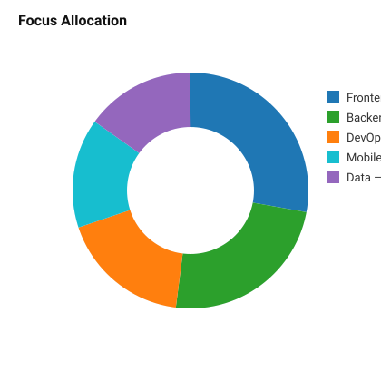
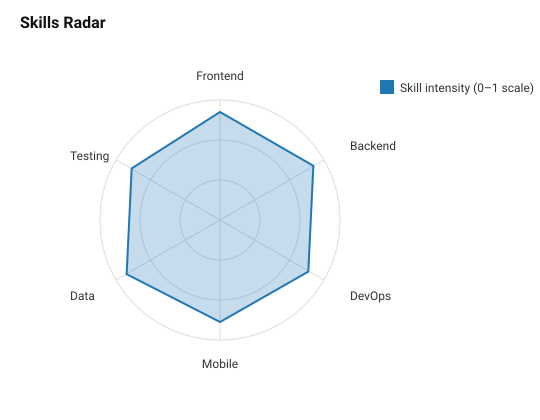

## Hi there 👋

I build scalable web and mobile applications as a Full-Stack Engineer, focusing on modern JavaScript, TypeScript, PHP, and cloud-native infrastructure. This repo contains a concise professional profile, visual skills graphs, and materials you can reuse for a portfolio or CV.

**Profile & visuals**

- Full profile: [PROFILE.md](PROFILE.md)
- Visual assets: [assets/tech-bar.svg](assets/tech-bar.svg), [assets/timeline.svg](assets/timeline.svg), [assets/skill-pie.svg](assets/skill-pie.svg)
 
**Rendered visuals**

- Tech proficiency: 
- Career timeline: 
- Focus allocation: 
- Skills radar: 

**Highlights**

- Frontend: Next.js, React, TypeScript, performance tuning
- Backend: Node.js, NestJS, Laravel, REST & GraphQL
- Databases: PostgreSQL, MongoDB, Redis
- Mobile: React Native (Expo)
- DevOps: Docker, Kubernetes, Terraform, CI/CD (GitHub Actions)

**Usage**

- Reuse `PROFILE.md` as a one-page summary for applications or LinkedIn.
- Open the SVGs in a browser or embed them in a personal site for clean visuals.
- To generate a PDF résumé from `PROFILE.md`, export via VS Code or use a markdown-to-pdf tool.

**Contact**

- Email: hello@yourdomain.com
- LinkedIn: linkedin.com/in/yourprofile

If you want, I can: convert the profile to a printable PDF, create a LinkedIn-optimized summary, or tailor the resume for a specific role — tell me which option you prefer.
